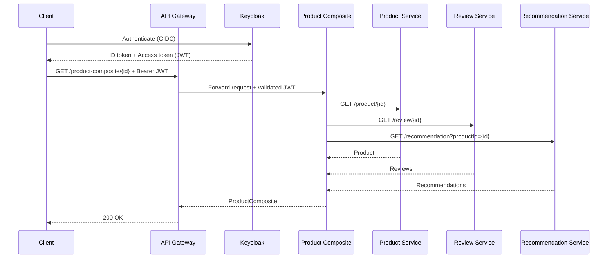

# Trafalgar — Vue d’ensemble du fonctionnement

## Objectif du système
Le système est composé de micro-services qui exposent des fonctionnalités produit, recommandations et commentaires, et d’un service d’agrégation (Product Composite) qui fournit une vue consolidée d’un produit. Le déploiement est orchestré via Docker Compose.

## Topologie des services
- Product Service: CRUD des produits
- Review Service: gestion des commentaires (MySQL/JPA)
- Recommendation Service: gestion des recommandations (MongoDB)
- Product Composite Service: agrégation réactive des trois services via WebClient

## Flux fonctionnels
### Lecture d’un produit consolidé
1. Client appelle `GET /product-composite/{productId}`
2. Product Composite déclenche en parallèle:
   - `GET product-service/product/{productId}`
   - `GET review-service/review/{productId}`
   - `GET recommendation-service/recommendation?productId={productId}`
3. Agrégation des réponses dans `ProductComposite` et retour au client

### Création d’un produit avec ses avis et recommandations
1. Client appelle `POST /product-composite` avec un corps `ProductComposite`
2. Product Composite:
   - `POST product-service/product` (création produit)
   - `POST review-service/review` pour chaque review
   - `POST recommendation-service/recommendation` pour chaque recommendation
3. Retour 200/204 une fois toutes les opérations terminées (non transactionnel distribué)

### Suppression d’un produit
1. Client appelle `DELETE /product-composite/{productId}`
2. Product Composite:
   - `DELETE product-service/product/{productId}`
   - `DELETE review-service/review/{productId}`
   - `DELETE recommendation-service/recommendation?productId={productId}`

## Rôles des composants
- Product Composite Controller: expose `/product-composite` et orchestre via `ProductCompositeIntegration`
- ProductCompositeIntegration: clients HTTP (WebClient) vers Product/Review/Recommendation
- Product Service: service applicatif + persistance via repository/mapper/entity
- Review Service: API REST + couche service + Spring Data JPA vers MySQL
- Recommendation Service: API REST + couche service + MongoRepository vers MongoDB

## Déploiement (docker-compose)
- Les services sont définis avec leurs images et réseaux; Review dépend de MySQL et Recommendation de MongoDB.
- Le Product Composite résout les services via leurs hôtes (ex: `http://product-service/product`).

## Sécurité et propagation des identités
- Dans l’état actuel, pas d’authentification intégrée visible dans le code du Product Composite et Product Service.
- En production, une gateway ou un filtre serait responsable de la validation JWT (Keycloak) et de la propagation des claims aux micro-services.

## Points d’attention
- Résilience: prévoir timeouts, retries, circuit breakers pour les appels inter-services
- Consistance: opérations de création/suppression non transactionnelles (penser compensations)
- Observabilité: ajouter logs corrélés, metrics et tracing (ex: OpenTelemetry)

## Références d’API
- Product Composite: voir `docs/product-composite-service.md`
- Product Service: voir `docs/product-service.md`
- Review Service: endpoints `GET /review/{productId}`, `POST /review`, `PUT /review/{reviewId}`, `DELETE /review/{productId}`
- Recommendation Service: endpoints `GET /recommendation?productId={productId}`, `POST /recommendation`, `DELETE /recommendation?productId={productId}`
