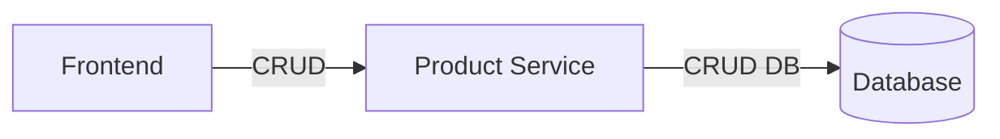

# Product Service — Documentation technique

## Nom et description
- Nom: Product Service
- Description: Fournit une API CRUD pour la gestion des produits.

## Installation et exécution
- Dépendances: Spring Boot
- Démarrage: via Docker Compose ou Gradle (voir `product-service/Dockerfile` et `docker-compose.yaml` du projet racine)

## Architecture (Hexagonale)
- API (Controller): `ProductController`
- Domaine/DTO: `Product`
- Application/Service: `ProductService`, `ProductServiceImpl`
- Adapter de persistance: `ProductRepository`, `ProductMapper`, `ProductEntity`

## Modèle de données
- `Product`: `{ productId: int, name: String, weight: int }`
- `ProductEntity`: entité de persistance correspondant à la table associée

## API Reference
Base path: `/product`

- GET `/`
  - Réponse: `List<Product>`

- GET `/{productId}`
  - Réponse: `Product`

- POST `/`
  - Corps: `Product`
  - Réponse: `Product` créé

- DELETE `/{productId}`
  - Effet: suppression de l'entité correspondant au `productId`

## Logique de service
`ProductServiceImpl`:
- `createProduct(Product)` → mapping vers `ProductEntity`, `save`, remap vers API
- `getProducts()` → `findAll()` puis mapping liste
- `getProduct(int)` → `findByProductId(productId)` puis mapping
- `deleteProduct(int)` → `delete(repository.findByProductId(productId))`

## Sécurité
- Aucun mécanisme d'authentification/autorisation intégré dans ce service. À protéger via gateway et propagation de JWT si nécessaire.

## Tests
- Tests non visibles dans les extraits fournis pour `product-service`. Recommandations:
  - Tests unitaires du mapper
  - Tests du service avec repository mocké
  - Tests d'intégration du controller (WebMvcTest)

## Points d'attention
- Gestion d'erreur si `getProduct(int)` ne trouve pas l'entité (null/404).
- Validation des inputs pour `POST` (ex. `name`, `weight`).
