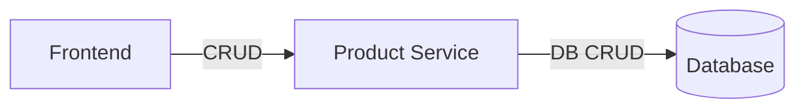

# Product Service — Documentation technique

## Vue d'ensemble
Le service Product expose une API CRUD pour gérer les produits. Il s'appuie sur Spring Boot et une couche de persistance via un repository et un mapper.

## Architecture (Hexagonale)
- API (Controller): `ProductController`
- Domaine/DTO: `Product`
- Application/Service: `ProductService`, `ProductServiceImpl`
- Adapter de persistance: `ProductRepository`, `ProductMapper`, `ProductEntity`

## Modèle de données
- `Product`: `{ productId: int, name: String, weight: int }`
- `ProductEntity` (persistance): représente la table en base (voir `persistence/ProductEntity.java`)

## API Reference
Base path: `/product`

- GET `/` → Liste des produits
  - Réponse: `List<Product>`

- GET `/{productId}` → Détail d'un produit
  - Réponse: `Product`

- POST `/` → Créer un produit
  - Corps: `Product`
  - Réponse: `Product` créé

- DELETE `/{productId}` → Supprimer un produit
  - Effet: suppression en base via `ProductRepository`

## Logique de service
`ProductServiceImpl`:
- `createProduct(Product)` → map vers `ProductEntity`, `save`, remap vers API
- `getProducts()` → `findAll()` puis mapping liste
- `getProduct(int)` → `findByProductId(productId)` puis mapping
- `deleteProduct(int)` → `delete(repository.findByProductId(productId))`

## Sécurité
- Aucun mécanisme d'authentification/autorisation intégré dans ce service au moment de l'analyse. À protéger via gateway ou filtres (JWT) si requis.

## Tests
- Les tests ne sont pas visibles dans les extraits fournis pour `product-service`. Ajouter idéalement:
  - Tests unitaires du mapper
  - Tests du service avec repository mocké
  - Tests d'intégration du controller (WebMvcTest)

## Points d'attention
- Gestion des erreurs dans `getProduct(int)` si produit non trouvé (null handling).
- Valider inputs dans `POST` (ex. champs obligatoires, types).
